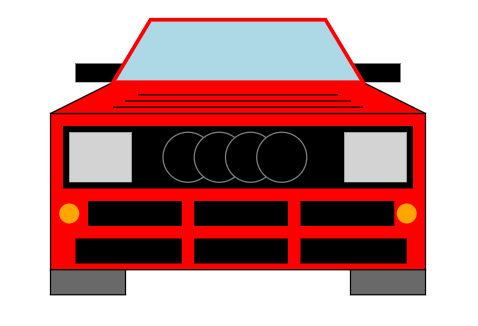
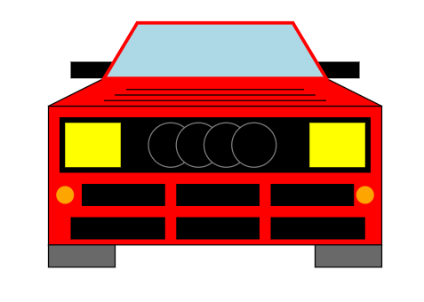

Assignment 1 - Hello World: GitHub and d3  
===

For this project, my main goal was to recreate a red 1984 Audi Quattro Sport (https://supercarnostalgia.com/blog/for-sale-1984-audi-quattro-sport-usa-1) using rectangles, circles, lines, and polygons. I manually appended individual elements to an SVG, and positioned/styled them in such a way that when combined, the recreation of the car is shown.

This is the vehicle recreation with the headlights turned off:

This is the vehicle recreation with the headlights turned on:

Resources referenced in code:
---

- https://d3js.org/getting-started
- https://d3-graph-gallery.com/graph/shape.html
- https://www.youtube.com/watch?v=bp2GF8XcJdY
- https://www.youtube.com/watch?v=cfuJJEdEWe8
- https://www.geeksforgeeks.org/javascript/d3-js-area-method/
- https://d3js.org/d3-selection/events
- https://stackoverflow.com/questions/25123003/how-to-assign-click-event-to-every-svg-element-in-d3js

GitHub Pages Link
---

Here is the gh-pages link: https://thelegacy-coder.github.io/a1-ghd3/

Technical Achievements:
---
- Created an array to hold positional data for the creation of polygons/trapezoids.
- Made use of the area() method in d3 to create the aforementioned polygons/trapezoids (one for the hood and another for the windshield).
- The user can mouseover each headlight to change its color from gray to yellow and vice-versa, which is possible due to my implementation of a function within the "on" call that contains an if-statement that modifies the "fill" attribute of the respective element.

Design Achievements:
---
- Was able to make use of numerous individual elements to recreate the front end of a vehicle.
- The headlights being yellow when they turn on adds to the overall retro theme that comes with the chosen vehicle (a 1980s street-legal rally car).
